# Yele’s Carrot Sauce : an Exquisite Touch of Healthy

[Uncategorized](https://estheradeniyi.com/category/uncategorized/)
# Yele&#x2019;s Carrot Sauce : an Exquisite Touch of Healthy

by [Esther Adeniyi](https://estheradeniyi.com/author/esther-adeniyi/)on [March 3, 2017April 27, 2018](https://estheradeniyi.com/yeles-carrot-sauce-exquisite-touch-of/)[6 Comments on Yele&#x2019;s Carrot Sauce : an Exquisite Touch of Healthy](https://estheradeniyi.com/yeles-carrot-sauce-exquisite-touch-of/#comments)

Sharing is caring!

- [0](https://www.facebook.com/sharer/sharer.php?u=https%3A%2F%2Festheradeniyi.com%2Fyeles-carrot-sauce-exquisite-touch-of%2F&amp;t=Yele%27s%20Carrot%20Sauce%20%3A%20an%20Exquisite%20Touch%20of%20Healthy)
- [0](https://twitter.com/intent/tweet?text=Yele%27s%20Carrot%20Sauce%20%3A%20an%20Exquisite%20Touch%20of%20Healthy&amp;url=https%3A%2F%2Festheradeniyi.com%2Fyeles-carrot-sauce-exquisite-touch-of%2F)
- [0](#)

0shares

 Yele is back with another super healthy dish. This is not all too easy like what we&#x2019;ve had. Let me put this as moderately easy. It is a move to enjoy and still eat something healthy. This is carrot sauce. You can pair it with rice, pasta or even yam. Let&#x2019;s get to the ingredients and preparation:

Ingredients:

[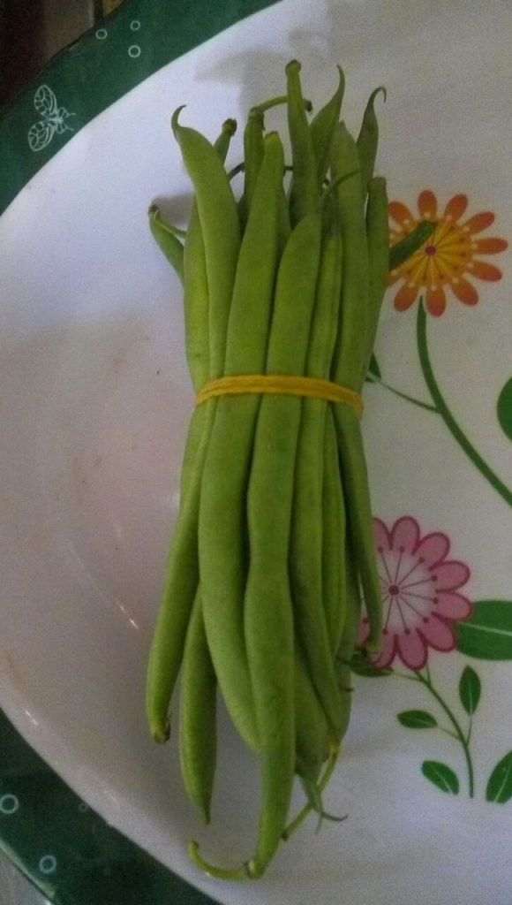](images/IMG-20170303-WA0004-580x1024.jpg)

[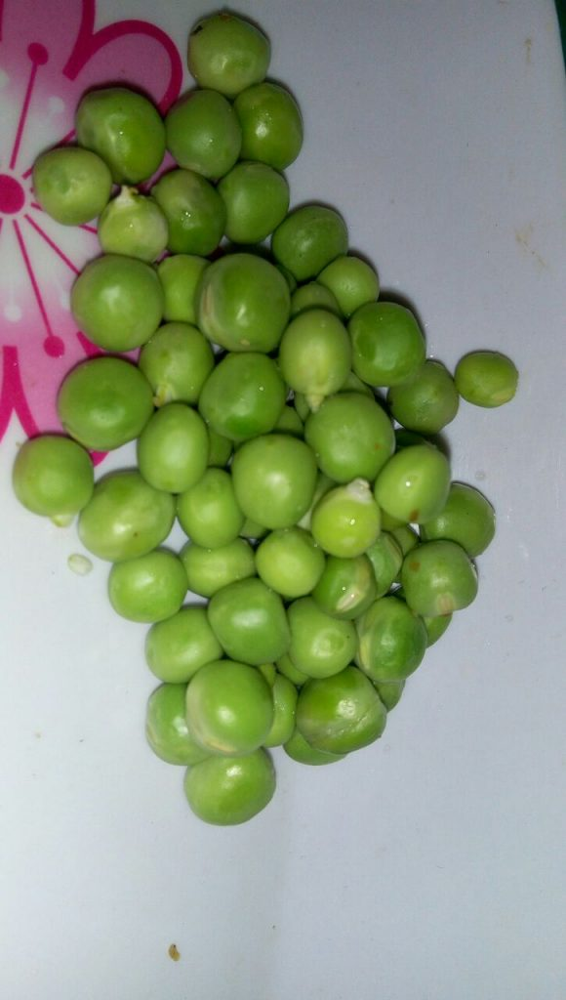](images/IMG-20170303-WA0005-580x1024.jpg)

[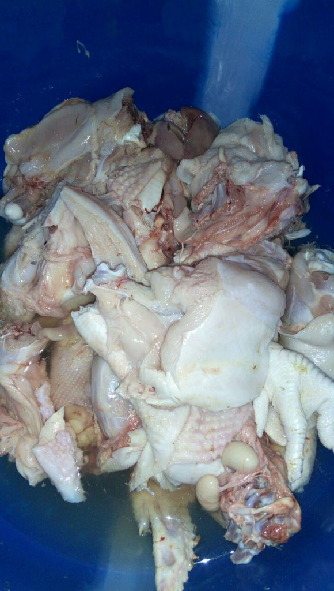](images/IMG-20170303-WA0006-580x1024.jpg)

[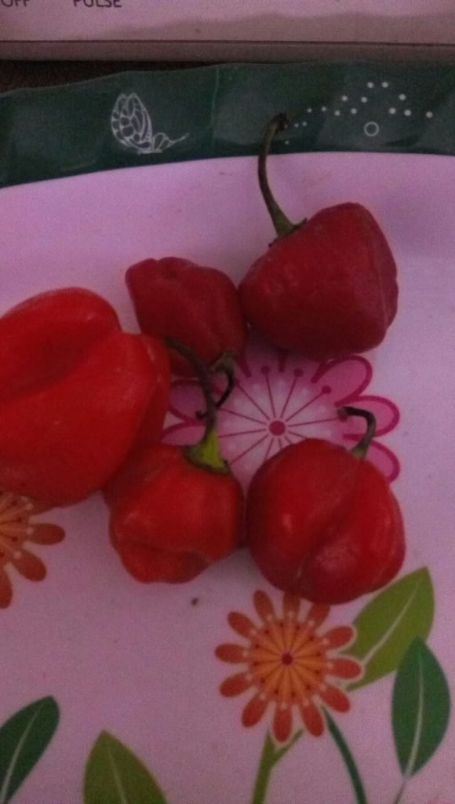](images/IMG-20170303-WA0007-580x1024.jpg)

[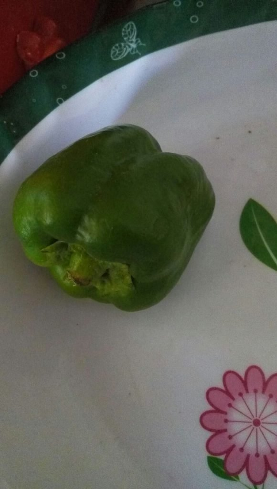](images/IMG-20170303-WA0011-580x1024.jpg)

 Carrot
 Green pepper
 Rodo
 Green peas
 Chicken
 Maggi
 Sunflower oil
 Knorr cubes
 Lime
 Chilli

Method:

-Grate carrot and set aside. Grate pepper too.

[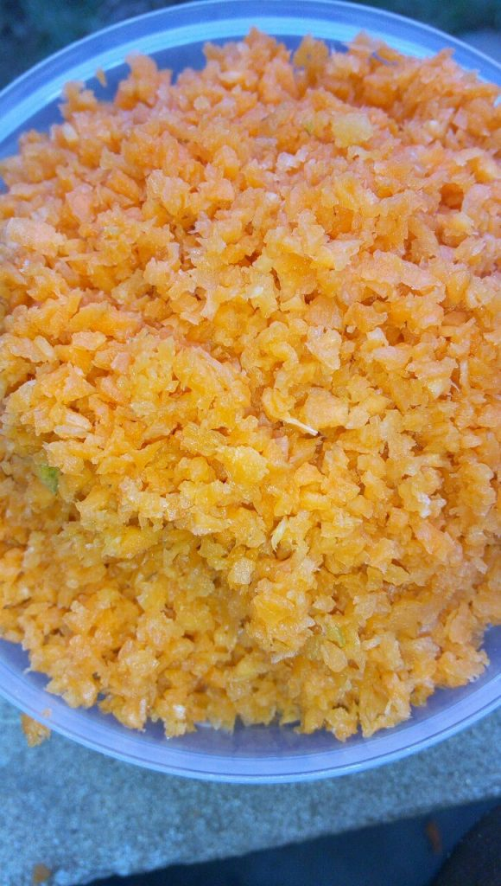](images/IMG-20170303-WA0009-580x1024.jpg)

[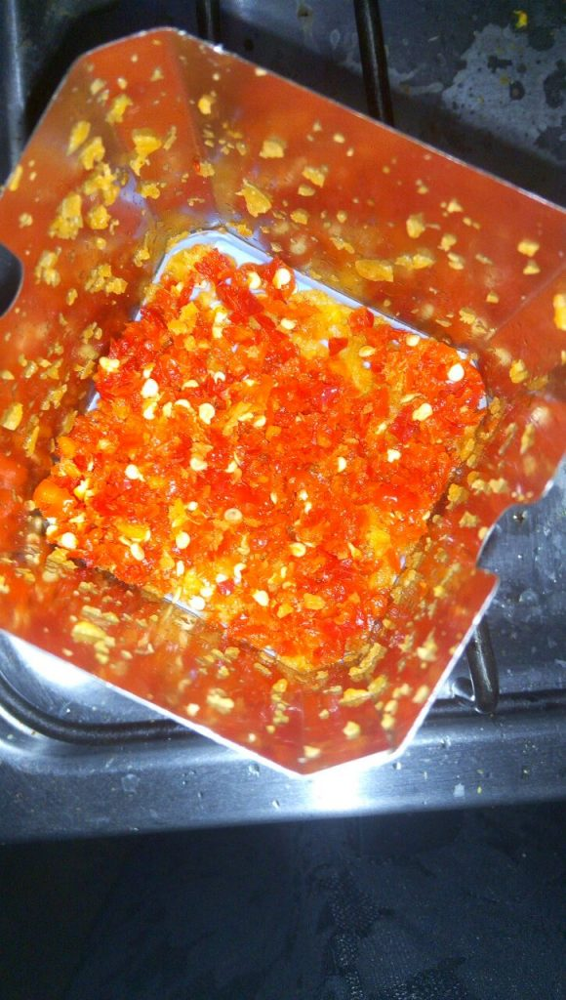](images/IMG-20170303-WA0016-580x1024.jpg)

 -Marinate (soak) chicken in cinnamon, thyme, a dash of lime, knorr cubes and chilli.

-Grill the marinated chicken.

[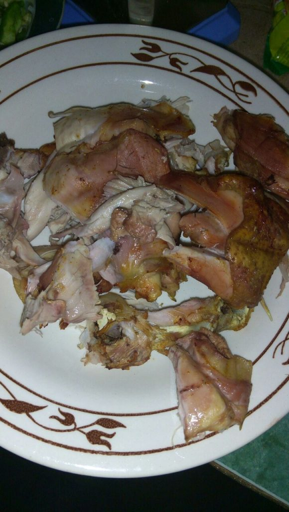](images/IMG-20170303-WA0015-580x1024.jpg)

 -Prepare the greens by dicing them.

[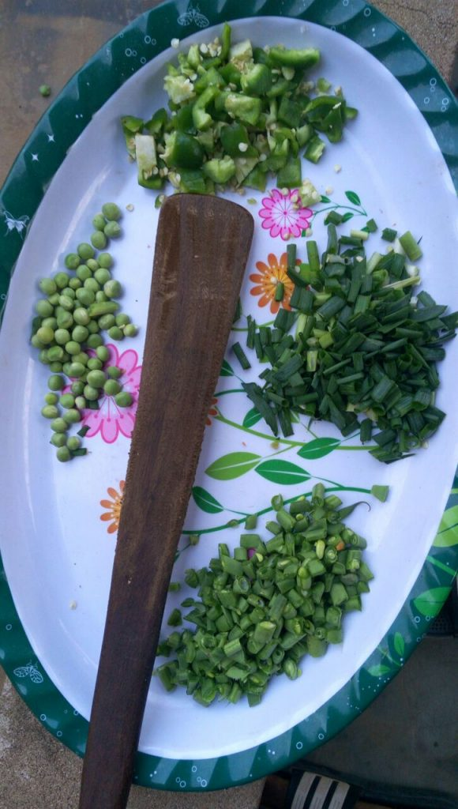](images/IMG-20170303-WA0017-580x1024.jpg)

 -Put the pot on fire and add sunflower oil. You can use any other type of oil too.

-Add in all the greens first and fry while continously stirring.

[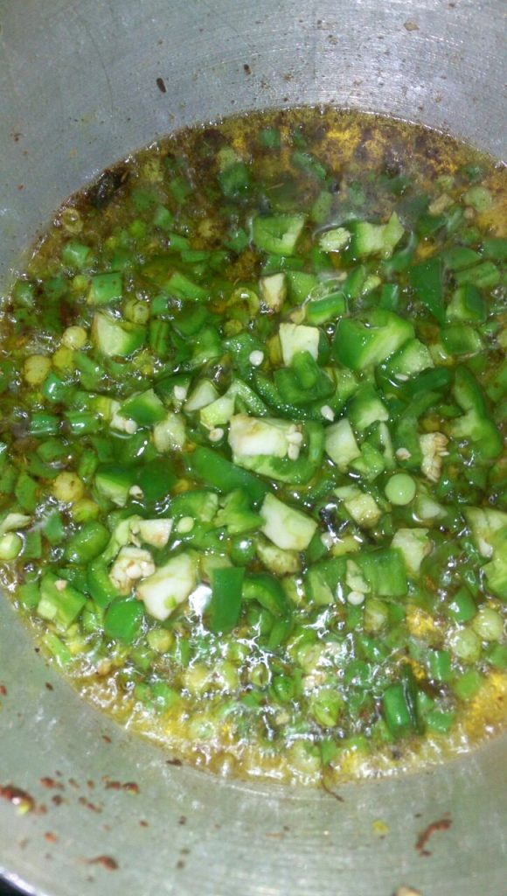](images/IMG-20170303-WA0014-580x1024.jpg)

 -Add in the pepper and then the chicken.

[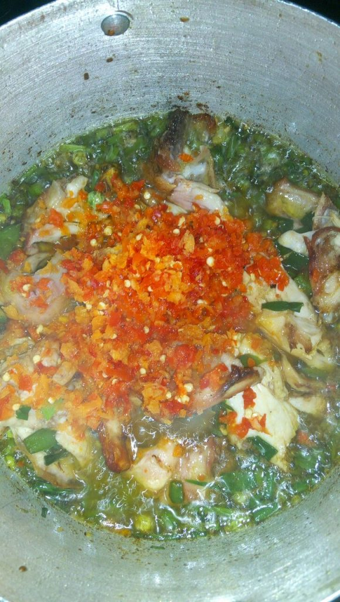](images/IMG-20170303-WA0020-580x1024.jpg)

 -Stir together and allow it to cook.

-Add in the carrot last. This is because it is going to shrink if added earlier.

-Stir together and cook for few more minutes and there you go &#x2013; your delicious carrot sauce.

[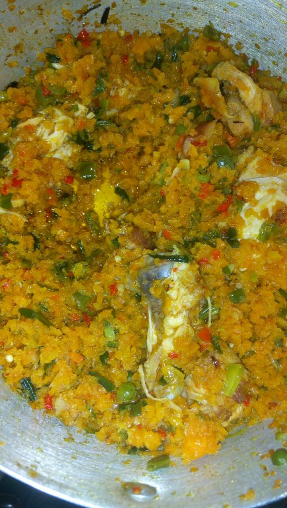](images/IMG-20170303-WA0021-580x1024.jpg)

 N. B- Chicken skin is peeled off as per fit fam something.

So, &#xA0;are you going to try this soon?

Sharing is caring!

- [0](https://www.facebook.com/sharer/sharer.php?u=https%3A%2F%2Festheradeniyi.com%2Fyeles-carrot-sauce-exquisite-touch-of%2F&amp;t=Yele%27s%20Carrot%20Sauce%20%3A%20an%20Exquisite%20Touch%20of%20Healthy)
- [0](https://twitter.com/intent/tweet?text=Yele%27s%20Carrot%20Sauce%20%3A%20an%20Exquisite%20Touch%20of%20Healthy&amp;url=https%3A%2F%2Festheradeniyi.com%2Fyeles-carrot-sauce-exquisite-touch-of%2F)
- [0](#)

0shares

Tags:[Food](https://estheradeniyi.com/tag/food/)