# Yoruba Traditional Wedding : Everything You Need to Know

[Weddings](https://estheradeniyi.com/category/weddings/)
# Yoruba Traditional Wedding : Everything You Need to Know

by [Esther Adeniyi](https://estheradeniyi.com/author/esther-adeniyi/)on [May 5, 2018May 5, 2018](https://estheradeniyi.com/yoruba-traditional-wedding/)[1 Comment on Yoruba Traditional Wedding : Everything You Need to Know](https://estheradeniyi.com/yoruba-traditional-wedding/#comments)

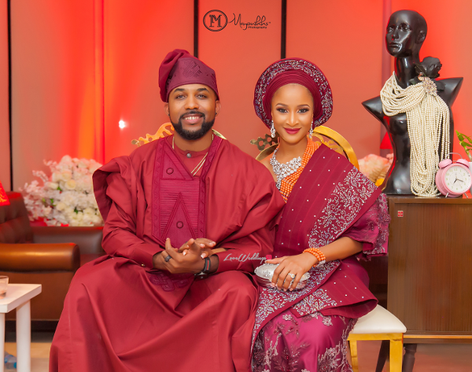

Sharing is caring!

- [41](https://www.facebook.com/sharer/sharer.php?u=https%3A%2F%2Festheradeniyi.com%2Fyoruba-traditional-wedding%2F&amp;t=Yoruba%20Traditional%20Wedding%20%3A%20Everything%20You%20Need%20to%20Know)
- [0](https://twitter.com/intent/tweet?text=Yoruba%20Traditional%20Wedding%20%3A%20Everything%20You%20Need%20to%20Know&amp;url=https%3A%2F%2Festheradeniyi.com%2Fyoruba-traditional-wedding%2F)
- [1](#)

42shares

**The Yoruba traditional wedding** is one of the most glamorous yet somewhat complicated type of weddings in Nigeria. You cannot deny however that the Yoruba traditional wedding is extremely fun. Whether you are attending one or you are the one whose wedding is on, &#xA0;it&#x2019;s an interesting time to be Yoruba. If you ask any attendee, the first side attraction they are fighting for is the [party jollof rice](https://estheradeniyi.com/nigerian-party-jollof-rice-step-by-step/). You don&#x2019;t want to miss this one.

If we were to also mention that the Yoruba wedding is full of so much of colour, vibrancy and excitement, it won&#x2019;t be an exaggeration. The Yoruba traditional wedding attires wow everyone that has ever seen this type of wedding for the first time. First, the Yoruba bride is elegantly made up and then she displays her dancing prowess. The friends of the groom prepare to rock the wedding in their Yoruba demons demeanor.

Yoruba wedding is one that you never want to miss. Some people even say that they just dress up and attend the nearest wedding because they are sure to[ eat the semo](https://estheradeniyi.com/smooth-lumpless-semo-in-10-minutes/) and if they are lucky, the [authentic efo riro](https://estheradeniyi.com/this-efo-riro-soup-recipe-is-best-ye/) supports the mission. This article is to teach you everything that you need to know about Yoruba traditional wedding.

We will talk about those things you have already known and other things you would like to know. If you are preparing for your own wedding, this article is comprehensive enough to serve as a guide. So, read on and have fun the Yoruba way.

Also read: [How to choose Plus size wedding dresses](https://estheradeniyi.com/plus-size-wedding-dresses/)

Contents

- [1 Yoruba Traditional Wedding List](#Yoruba_Traditional_Wedding_List)
- [1.1 Below is a typical eru iyawo list](#Below_is_a_typical_eru_iyawo_list)

- [2 Other fees at the Yoruba Wedding ceremony](#Other_fees_at_the_Yoruba_Wedding_ceremony)
- [3 Some Elegant Eru iyawo pictures](#Some_Elegant_Eru_iyawo_pictures)
- [4 Yoruba Traditional Wedding Colours](#Yoruba_Traditional_Wedding_Colours)
- [5 Yoruba Traditional Wedding Programme](#Yoruba_Traditional_Wedding_Programme)
- [5.1 First, the Introduction ceremony](#First_the_Introduction_ceremony)
- [5.2 The Engagement Ceremony](#The_Engagement_Ceremony)
- [5.3 The basic procession of events of the engagement ceremony are but not limited to:](#The_basic_procession_of_events_of_the_engagement_ceremony_are_but_not_limited_to)

- [6 Yoruba Traditional Wedding Attires](#Yoruba_Traditional_Wedding_Attires)
- [7 Yoruba Wedding Songs you can choose from](#Yoruba_Wedding_Songs_you_can_choose_from)
- [8 Yoruba Traditional wedding videos](#Yoruba_Traditional_wedding_videos)
- [8.1 Tolulope and Gbemiga Adejumo](#Tolulope_and_Gbemiga_Adejumo)
- [8.2 Dami and Deji&#x2019;s traditional Wedding Trailer](#Dami_and_Deji8217s_traditional_Wedding_Trailer)
- [8.3 Oluwakemi and Omololumide&#x2019;d Yoruba Wedding](#Oluwakemi_and_Omololumide8217d_Yoruba_Wedding)

## Yoruba Traditional Wedding List

This is also known as eru iyawo. In the Yoruba culture, when the groom&#x2019;s family makes it known to the bride&#x2019;s family of their intentions to marry her into the family, preparations for the proper introduction ceremony and traditional wedding begin.

The bride&#x2019;s family then prepares a list of eru iyawo to be given to them. This list varies from family to family. Some Yoruba families are more liberal than the others these days. Some are still traditional, so to speak. However, there are some common things on this eru iyawo list.

### Below is a typical eru iyawo list

Pack of Sugar

Baskets of Fruit

Decanters filled with honey

Crates of canned or soft drinks

Crates malt soft drinks

Cartons of bottled water

Bottles of non alcoholic wine

Cartons of fruit juice

Alligator Peppers

Pieces of dried Fish

Dish of peppered corn meal

Bag of salt

Bag of rice

Live Goat

Keg of palmwine

Keg of groundnut oil

Bitter kolas

Tubers of yam

Kolanuts

Big suitcase containing beautiful clothes, shoes and hand bags

Wrist watch, Earrings and Chains

Biscuits and Sweets

Engagement rings for bride and groom

Quran, praying mat, veil, praying kettle, rosary, white hijab, and tasbir (for Muslim weddings)

Bible(for Christians)

You might be interested: [how much does a wedding cost?](https://estheradeniyi.com/how-much-does-wedding-cos/)

## Other fees at the Yoruba Wedding ceremony

The Bride Price

Money for the elders&#x2019; consent

Money for the bride&#x2019;s father&#x2019;s consent

Money for the bride&#x2019;s mother&#x2019;s consent

Door knocking fee

Fee to call the bride out

Fee for unveiling the bride

Letter reading fee

Bride transportation fee

Money for the Housewives

Money for the Children of the household

Engagement gifts unveiling fee

Master of Ceremonies fee

## Some Elegant Eru iyawo pictures

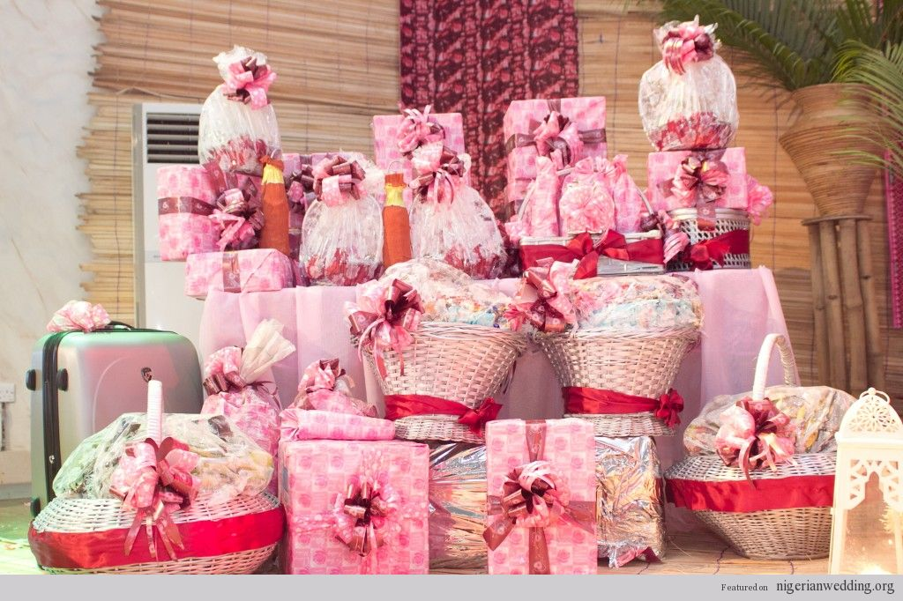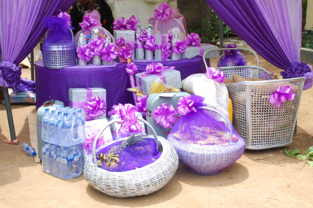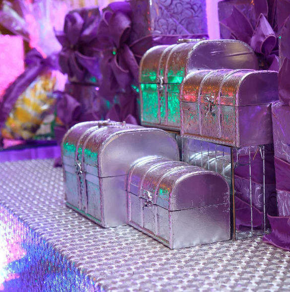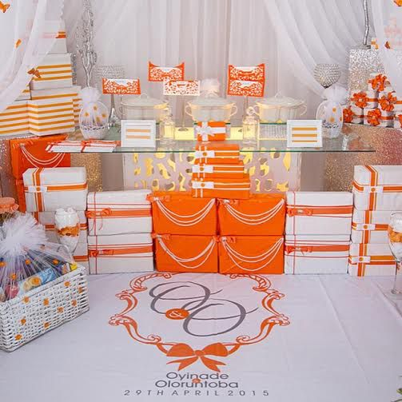

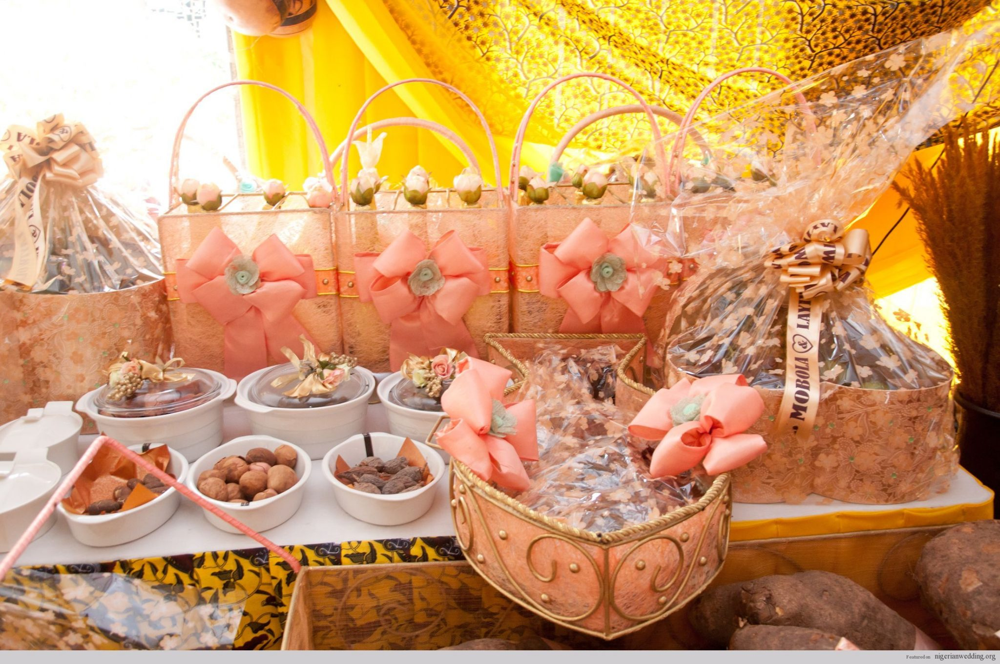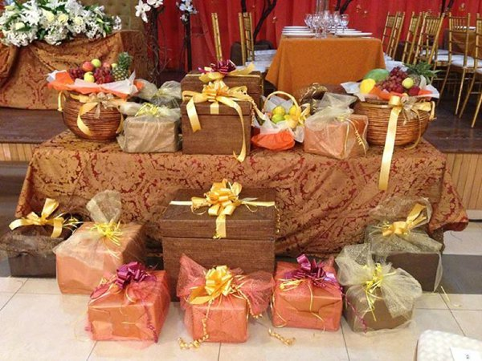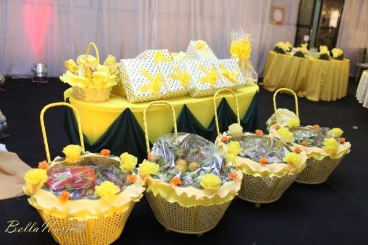

## Yoruba Traditional Wedding Colours

Deciding colours for your traditional wedding can be a little bit dicey. Even though the bride is mostly given the privilege to pick colours, it is important to make sure that the groom and his family are carried along. It&#x2019;s can be very frustrating to finally decide on your traditional wedding colours especially if you have a lot of fashion savvy friends as the bride or your husband-to-be siblings are style maniacs.

Colour picking is however necessary as it adds so much of glamour to the ceremony. In scenario where it is becoming too difficult to agree on a colour, pick a choice from both families and hope to God that the colours match. Examples of cool and popular colour combinations of your traditional Yoruba wedding are:

Purple and yellow

Blue and silver

Blue and yellow

Cobalt blue and red

Wine and cream

Red and cream

White and any other colour

Silver and any other colour

All white and hints of another colour (you can be daring anyway)

Peach and light green

## Yoruba Traditional Wedding Programme

The Yoruba traditional wedding is divided into two segments, namely: the introduction ceremony and the engagement ceremony.

### First, the Introduction ceremony

Now, in this time and age, things have become different but there is usually a basic procedure on which all of these ceremonies are hinged. What then happens is that the family now decides to modify or not. The introduction ceremony involves the family of both the bride and the groom. In the Yoruba culture, the bride hosts the family of the groom. They receive them and treat them well.

Even though parents, siblings and family friends of the bride or groom might have had contact with themselves prior to this event, the introduction ceremony is to allow for formal introduction of both families to themselves. There is a discussion amongst the family members on this joyous day. Elders from the family are also present as representatives of the extended family. A few close friends too are around.

Depending on the status and the financial capabilities of the families involved, this ceremony may be simple or elaborate. Some people have their introduction ceremony as elegant as a wedding. It all depends on your purse. This is however not necessary. What matters is that both families meet and are introduced to each other formally.

The date for the engagement ceremony is then picked during the introduction ceremony. After deliberation and consideration, they begin to plan towards a set date. This is not to say that dates cannot be changed in the eventuality of something important coming up. Dates can be shifted backwards or forwards. What matters is that both families reach an agreement at each step of the way.

### The Engagement Ceremony

The engagement ceremony is where the bride and the groom become husband (oko) and wife (iyawo) according to the Yoruba tradition. Some people choose to celebrate this the same day as the day of their white wedding ceremony. The engagement ceremony is usually filled with a lot of dancing, singing and praying.

### The basic procession of events of the engagement ceremony are but not limited to:

1. Arrival of the bride&#x2019;s family

The bride&#x2019;s family officially arrive into the vicinity of the proposed venue of the engagement ceremony

2. The arrival of the groom&#x2019;s family

The groom&#x2019;s family officially arrive into the vicinity of the proposed venue of the engagement ceremony.

1. Reading of the letter from groom&#x2019;s family

The letter is read by someone from the bride&#x2019;s family to the hearing of everyone

1. Reading of the acceptance letter from brides family

The letter is read out loud also

1. Groom arrives

The groom and his Yoruba demons dance in and prostrates to the family of the bride. This signifies a plea and permission to take the bride home to be wife.

1. Bride arrives

This is one of the most anticipated part of the engagement ceremony as there is a lot of dancing. The bride and her friends dance into the arena elegantly and the guests, especially the groom, anticipate to receive them.

1. Presentation of the gifts
2. Presentation of the ring
3. Introduction of family members
4. Cutting of cake
5. Dowry is presented
6. Both parents pray for the couple

All of these is not a hard and fast programme. The anchor is the one who determines how long, short, boring or interesting the engagement ceremony turns out.

## Yoruba Traditional Wedding Attires

Like we mentioned earlier, the colours that comprise the Yoruba wedding are enough to keep you excited. Aso oke, lace and guinea are liberally used in this type of wedding. We have some very interesting pictures of the Yoruba wedding attires below.

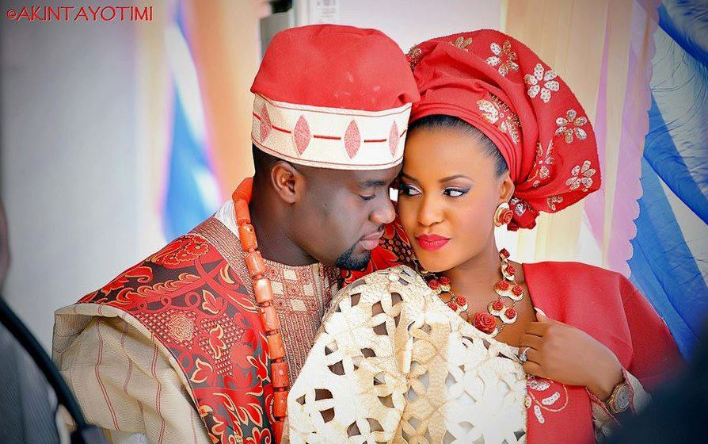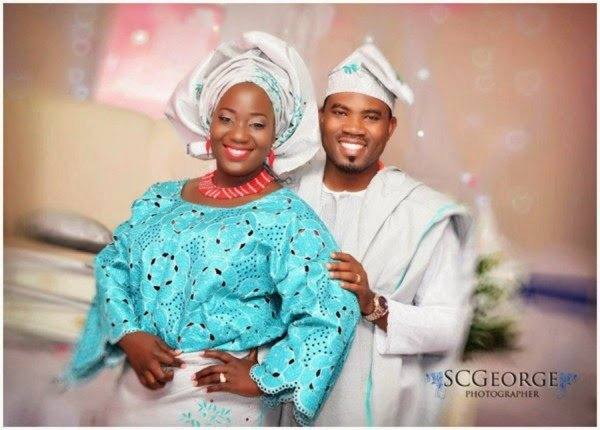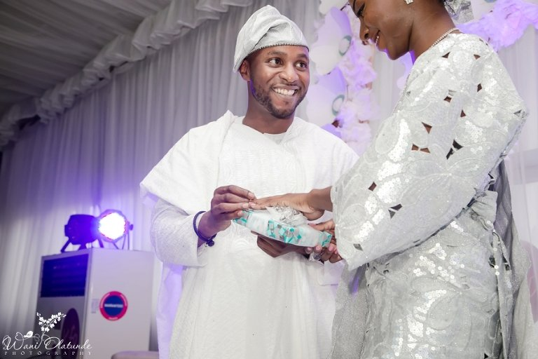

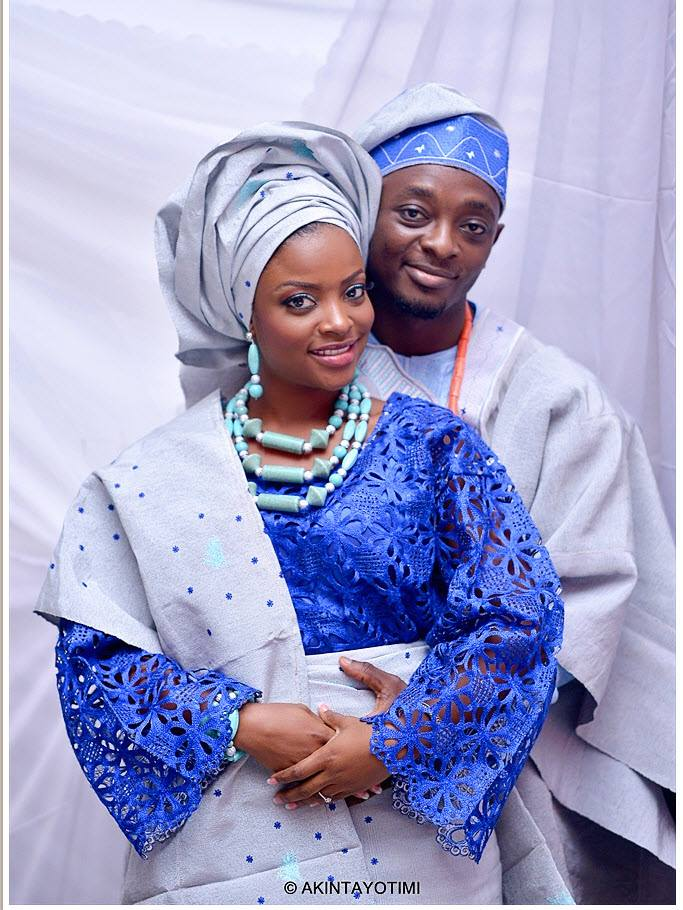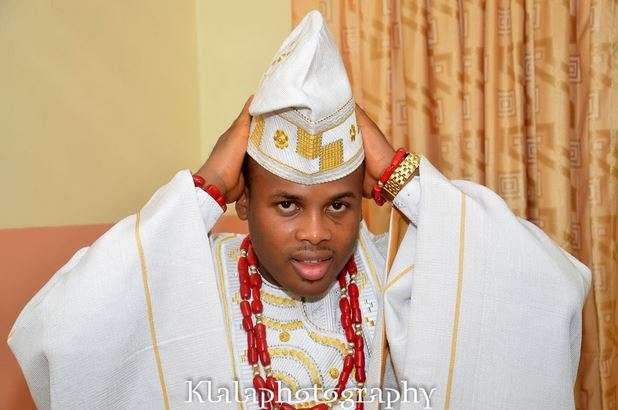

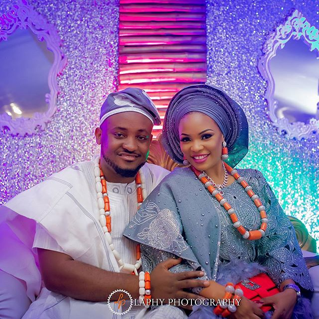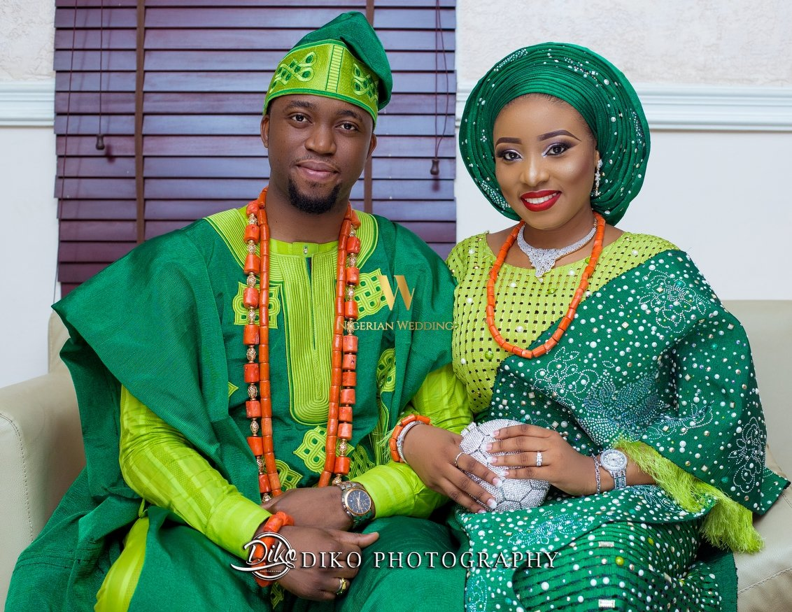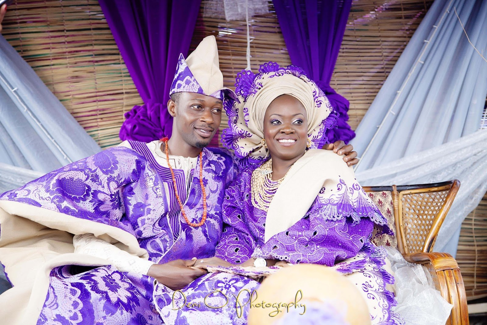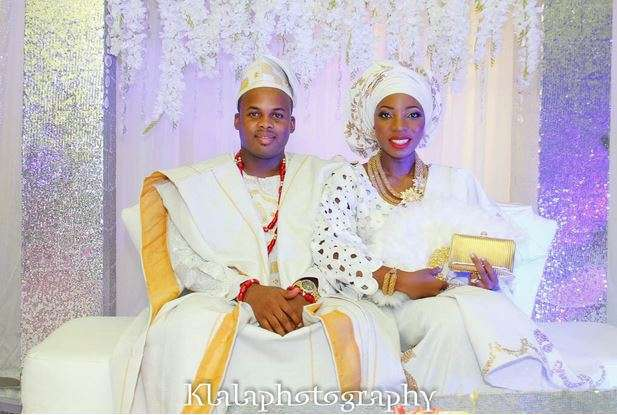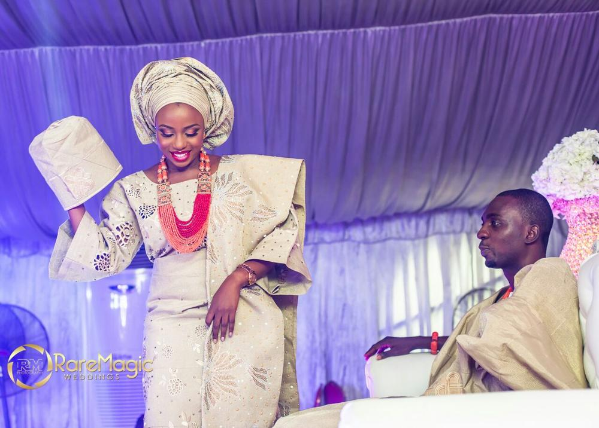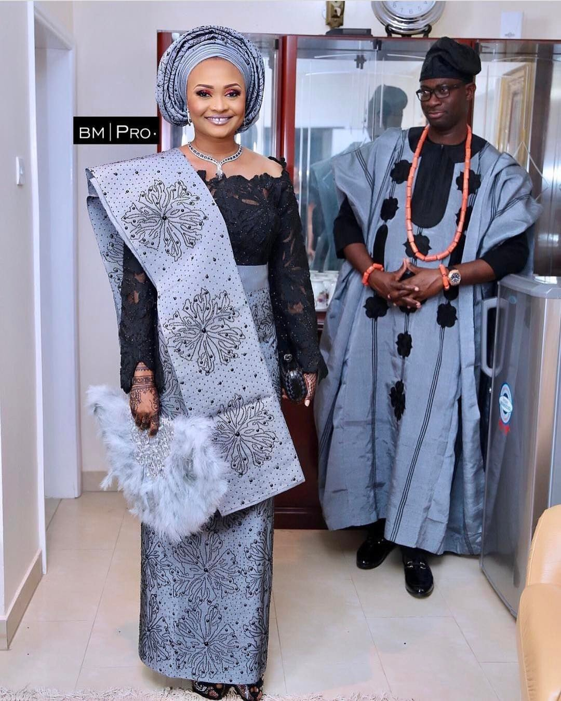

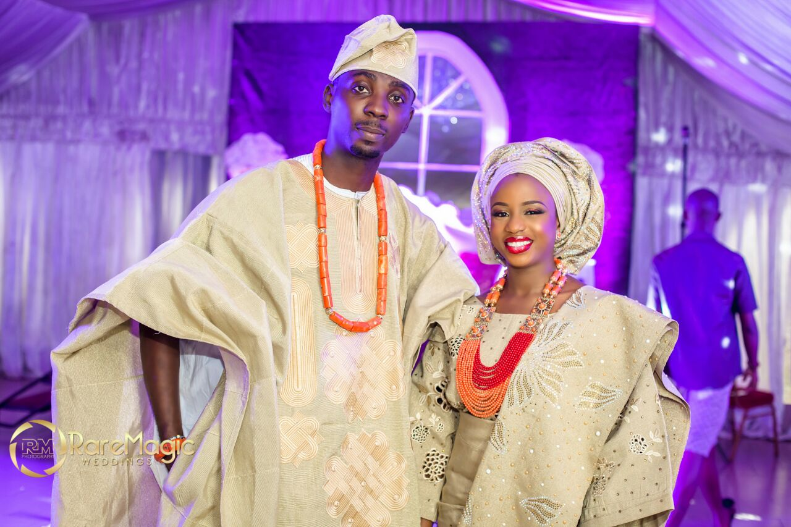

## Yoruba Wedding Songs you can choose from

Oruka by Sunny Neji

Oko mi by Ju Spice

[Iyawo mi by Timi Dakolo](https://estheradeniyi.com/iyawo-mi-timi-dakolo-lyrics/)

Ife wa gbona by Tiwa Savage

Olomi by Tosin Martins

Igbeyawo by oritse femi

Wedding day by 9ice

## Yoruba Traditional wedding videos

### Tolulope and Gbemiga Adejumo

&#xA0;

### Dami and Deji&#x2019;s traditional Wedding Trailer

### Oluwakemi and Omololumide&#x2019;d Yoruba Wedding

What would you like us to add to this Yoruba traditional wedding compilation. Did you enjoy the article?

Related: [I can design a wedding blog for you](https://estheradeniyi.com/i-can-design-beautiful-wedding-blog-for/)

Sharing is caring!

- [41](https://www.facebook.com/sharer/sharer.php?u=https%3A%2F%2Festheradeniyi.com%2Fyoruba-traditional-wedding%2F&amp;t=Yoruba%20Traditional%20Wedding%20%3A%20Everything%20You%20Need%20to%20Know)
- [0](https://twitter.com/intent/tweet?text=Yoruba%20Traditional%20Wedding%20%3A%20Everything%20You%20Need%20to%20Know&amp;url=https%3A%2F%2Festheradeniyi.com%2Fyoruba-traditional-wedding%2F)
- [1](#)

42shares

Tags:[Nigerian wedding](https://estheradeniyi.com/tag/nigerian-wedding/)[Yoruba traditional wedding](https://estheradeniyi.com/tag/yoruba-traditional-wedding/)[Yoruba wedding](https://estheradeniyi.com/tag/yoruba-wedding/)[Yoruba wedding attire](https://estheradeniyi.com/tag/yoruba-wedding-attire/)[Yoruba wedding programme](https://estheradeniyi.com/tag/yoruba-wedding-programme/)