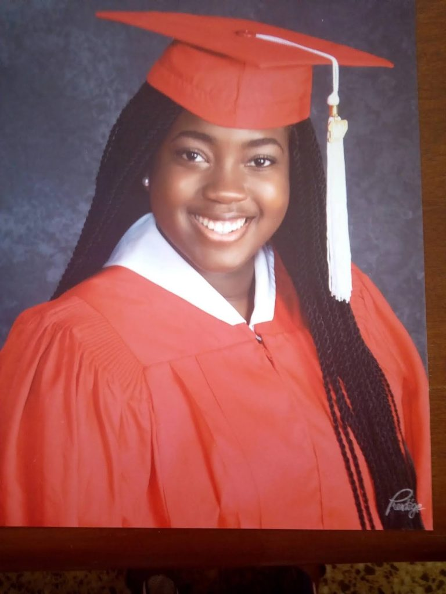

# Young Nigerian woman Is offered scholarship by 11 US Universities

[Uncategorized](https://estheradeniyi.com/category/uncategorized/)
# Young Nigerian woman Is offered scholarship by 11 US Universities

by [Esther Adeniyi](https://estheradeniyi.com/author/esther-adeniyi/)on [June 26, 2017April 27, 2018](https://estheradeniyi.com/young-nigerian-woman-is-offered/)[Leave a Comment on Young Nigerian woman Is offered scholarship by 11 US Universities](https://estheradeniyi.com/young-nigerian-woman-is-offered/#respond)

Sharing is caring!

- [0](https://www.facebook.com/sharer/sharer.php?u=https%3A%2F%2Festheradeniyi.com%2Fyoung-nigerian-woman-is-offered%2F&amp;t=Young%20Nigerian%20woman%20Is%20offered%20scholarship%20by%2011%20US%20Universities)
- [0](https://twitter.com/intent/tweet?text=Young%20Nigerian%20woman%20Is%20offered%20scholarship%20by%2011%20US%20Universities&amp;url=https%3A%2F%2Festheradeniyi.com%2Fyoung-nigerian-woman-is-offered%2F)
- [0](#)

0shares

 According to [Leadership](http://leadership.ng/2017/06/25/18-year-old-nigerian-shines-us-11-universities-offer-scholarship/), an eighteen year old Nigerian, Uwade Helen Akhere, has made history to becoming &#xA0;the cynosure of all eyes in faraway United State of America, as she won 11 Scholarships &#xA0;to American Universities to study after emerging tops in her academic pursuit at the Charlotte Catholic High School.

 Young Uwade, who hails from Edo State, was the President of the Student Council &#xA0;the prestigious Charlotte Catholic &#xA0;High School Charlotte NC, USA.

 The &#xA0;2017 Signet II , Volume XXII, graduating compendium of the school shows her coming tops in debate, speech &#xA0;and Theology, &#xA0;among others.

 Other awards include, National merit Scholarship commendation, the achievement awards for Charlotte Civitan Citizen and Charlotte post top senior &#xA0;in the class of 2017.

 Universities wooing Uwade are Cornell University Tanner Dean&#x2019;s Scholarship, Hampton University Undergraduate Merit Scholarship, Howard University Freshman Scholarship, Northwestern University Northwestern Scholarship, Northwestern University The 1851 Scholarship and Rice University Trustee Distinguish Scholarship.

 Others include, Tulane University offering her &#xA0;Premier Scholar award, University of Chicago Odyssey Scholar award, University of Chicago Odyssey Scholarship, University of North Carolina at Chapel Hill Morrison Scholarship and Villanova University Villanova Scholarship.

 It is worthy to note that the senior Class of 2017 has earned in Scholarship $21,231,383 for their many outstanding accomplishments.

 Speaking on the award, the father of the 18 year old girl, &#xA0;a Law Professor at the Ambrose Alli University, Ekpoma, Edo State , Professor Jim Akhere, a former Commissioner, in the defunct Bendel State of Nigeria said with the feat his daughter has performed &#xA0;it &#xA0;will not be far from the truth to label her &#xA0;a genius.

 He said: &#x201C;Am so proud as a father and thankful to God for what my daughter has done. She has made the Country proud. It is commendable &#xA0;that She came out tops in her school, she was the President of the School and won she won &#xA0;11 scholarship to different American Universities &#xA0; She has opted for Columbia University, an Ivory league . &#xA0;I am a law Professor, but I don&#x2019;t think I know as much as my daughter, of whom i &#xA0;am really proud. She debates, sings, acts and she &#xA0;is tops in her academics. I&#x2019;m eternally grateful to the Almighty for the gift of Uwa to humanity.

 While urging Nigerian youths to take their academic pursuits seriously Professor &#xA0;Akhere added that some of the qualities that make for success in life are &#xA0;hard work, and focus. I do believe that there are those who are gifted, and even these will not get anywhere except they work hard because genius is one percent inspiration and 99 percent perspiration.

 The elated academician also urged government to take the education and training of Nigerian youths more seriously, noting that it remain the best legacy any system can bequeath.

 &#x201C;Education is the best and fairest thing that the &#xA0;best of minds can ever have. Any government that does not take education seriously is not helping humanity. When you are young and you are given to life of acquisition of wealth to the detriment of education then there is a problem, knowledge is everything&#x201D; He added.

 Source : [Leadership](http://leadership.ng/2017/06/25/18-year-old-nigerian-shines-us-11-universities-offer-scholarship/)&#xA0;

Sharing is caring!

- [0](https://www.facebook.com/sharer/sharer.php?u=https%3A%2F%2Festheradeniyi.com%2Fyoung-nigerian-woman-is-offered%2F&amp;t=Young%20Nigerian%20woman%20Is%20offered%20scholarship%20by%2011%20US%20Universities)
- [0](https://twitter.com/intent/tweet?text=Young%20Nigerian%20woman%20Is%20offered%20scholarship%20by%2011%20US%20Universities&amp;url=https%3A%2F%2Festheradeniyi.com%2Fyoung-nigerian-woman-is-offered%2F)
- [0](#)

0shares

Tags:[Celebrating Women](https://estheradeniyi.com/tag/celebrating-women/)[News](https://estheradeniyi.com/tag/news/)