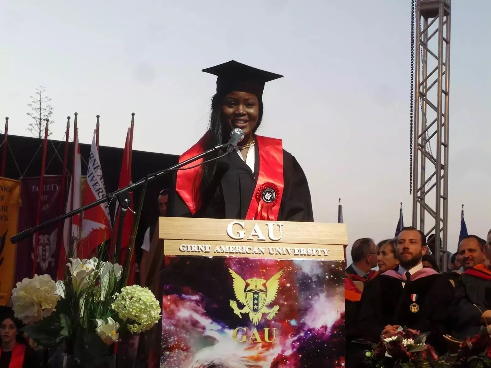

# Young Nigerian Woman Barges First Class in Cyprus Law Faculty

[Uncategorized](https://estheradeniyi.com/category/uncategorized/)
# Young Nigerian Woman Barges First Class in Cyprus Law Faculty

by [Esther Adeniyi](https://estheradeniyi.com/author/esther-adeniyi/)on [July 3, 2017April 27, 2018](https://estheradeniyi.com/young-nigerian-woman-student-barges/)[Leave a Comment on Young Nigerian Woman Barges First Class in Cyprus Law Faculty](https://estheradeniyi.com/young-nigerian-woman-student-barges/#respond)

Sharing is caring!

- [0](https://www.facebook.com/sharer/sharer.php?u=https%3A%2F%2Festheradeniyi.com%2Fyoung-nigerian-woman-student-barges%2F&amp;t=Young%20Nigerian%20Woman%20Barges%20First%20Class%20in%20Cyprus%20Law%20Faculty)
- [0](https://twitter.com/intent/tweet?text=Young%20Nigerian%20Woman%20Barges%20First%20Class%20in%20Cyprus%20Law%20Faculty&amp;url=https%3A%2F%2Festheradeniyi.com%2Fyoung-nigerian-woman-student-barges%2F)
- [0](#)

0shares

 A Nigerian lady, Ifeoma Chinenye Onuike, has made Nigeria proud in Cyprus as she clinched first class from Law faculty of Girne American University in Cyprus &#x2013; Onuike, who hails from Anambra state, beamed with smiles as she received her certificate from the university authority A

 s Nigerians are known for being the best in whatever and wherever they find themselves, Ifeoma Chinenye Onuike has, again, beamed the spotlight on the giant of Africa, graduating from Girne American University, as the best graduating student with a first class cumulative grade point average of 3.99/4.00 after acing all her courses from her first through her fourth year.&#xA0;

 The 25-year-old lady, who hails from Ukwulu in Dunukofia local government area of Anambra state, had her early education in Infant Jesus Nursery and Primary School Kubwa, Freedom Academy Nursery and Primary school Kubwa and L.E.A. Primary School Kubwa, all in Abuja, the Federal Capital Territory of Nigeria. Her secondary education was at Government Secondary School Kubwa Abuja, Government Secondary School Nakere, Nassarawa state.&#xA0;

 After several attempts to gain admission to study Law in different Nigerian universities, she got admitted into the prestigious University of Nigeria Nsukka, Enugu state where she studied Business Management and graduated in 2012. Subsequently, when the opportunity came to go to North Cyprus to study English common law, it was like starting all over from the beginning. Read more [here](https://www.naij.com/1112860-how-a-25-year-nigerian-female-student-ifeoma-onuike-clinched-class-cyprus-la.html):&#xA0;

Sharing is caring!

- [0](https://www.facebook.com/sharer/sharer.php?u=https%3A%2F%2Festheradeniyi.com%2Fyoung-nigerian-woman-student-barges%2F&amp;t=Young%20Nigerian%20Woman%20Barges%20First%20Class%20in%20Cyprus%20Law%20Faculty)
- [0](https://twitter.com/intent/tweet?text=Young%20Nigerian%20Woman%20Barges%20First%20Class%20in%20Cyprus%20Law%20Faculty&amp;url=https%3A%2F%2Festheradeniyi.com%2Fyoung-nigerian-woman-student-barges%2F)
- [0](#)

0shares

Tags:[Celebrating Women](https://estheradeniyi.com/tag/celebrating-women/)[News](https://estheradeniyi.com/tag/news/)